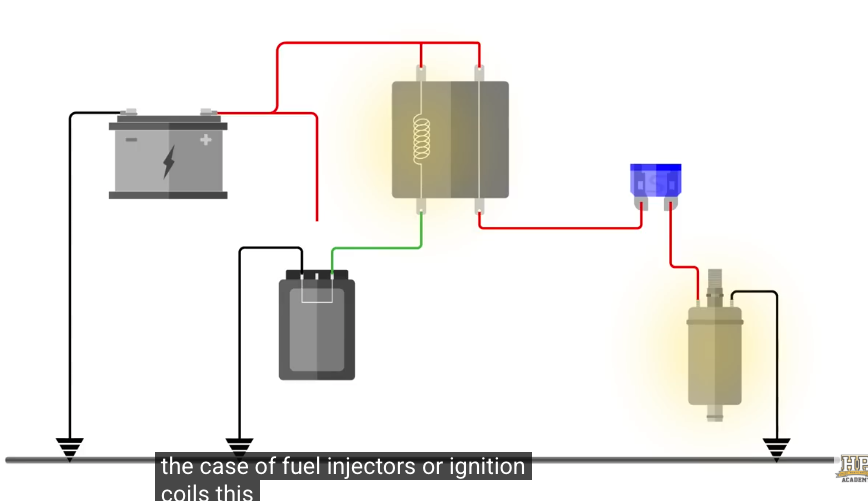
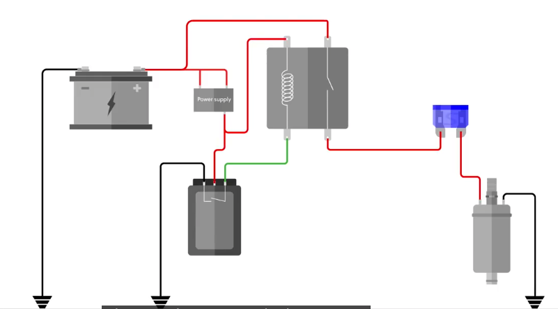

# Club level harness 
*notes by yy based on HP Academy video [here](https://www.youtube.com/watch?v=K12VFuqbeD4&t=2558s)*
**Melting points for different specs wires (deg C)**
Pvc - 85 (probably don’t use this)
TXL - 120 (club level this looks fine)
Tefzel  - 150

**Sheathing - tho not strictly necessary at a club level**
Abrasion resistance, strain alleviation
Expandable braid. (Looks nice :) + SCL wall heat shrink  (no protection from moisture, fluid; can end up melting, with a heat gun even) SCL is semi rigid so provides som strain relief
Fabric looming tape (used even in GT4) ( you don’t need the connector removed from the wiring harness to sheath it, so I guess it’s a good complementary)
NEVER use PVC convoluted tubing
Kapton tape
DR25 heat sheath

**Harness - Power Supply design**

1. List parts that require 12V power supply
   Commonly designed to have 2 power stages:
2. Main power, power that goes to ECU, dash display etc, anything we might want to programme and communicate with while the engine is NOT running
3. Enable power, Power supply to the actuators required for the engine to run
4. Fans etc, stuff that would have their power switched on/off by the ECU
   (Main power relay, enable power relay - driver)
   (Controlled by the ecu, fuel pump, radiator cooling fan)
   WIRES for each part — HEATING!!
   Splicing one power supply wire into individual components - consider current required for individual components, sum up
   Supply power, ground to ignition coils 18awg
   Injectors 22 awg
   Sensors, switches 22awg
   Fuel pump, cooling wires, 14awg (high current)

**Fuse**
150% of the largest current we would see
Injector & ignition coil fuses separatesly - injector about 15Amp

**ECU hold power**
Be aware of ECU back feeding


