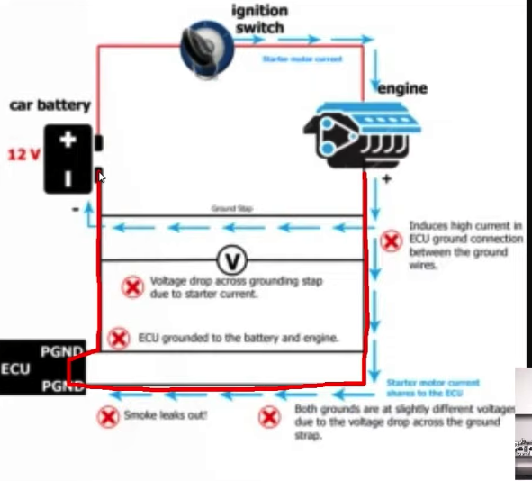
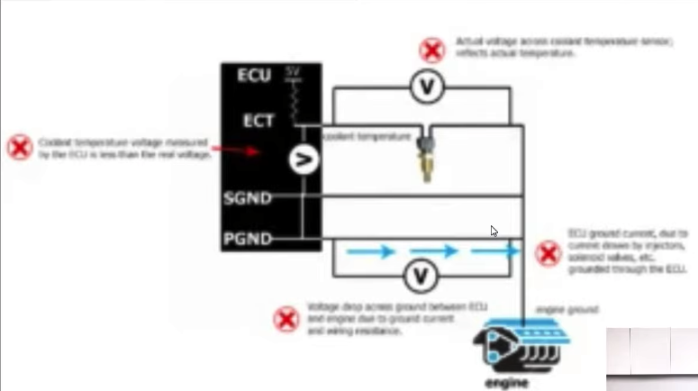

# Bad practrices

Dont double ground, especially not with ECU in the loop. e.g. dont ground ECU power ground to both engine and battery negative. This creates a parallel circuit between engine block and battery negative, with ECU in one branch. So if the grounding cable (our thick black cable, blue path on the diagram) between engine block & battery negative comes loose/come off, i.e. become higher impedance, current will go through ECU instead (red branch). Bad bad big current for ECU

Don't ground your sensor to both sensor ground (on ECU) and power ground. Image quality is horrid here but it should be obvious that if the engine to ecu pgnd path is high current, it will have a voltage drop over the conductor, pulling sensor ground reference higher. (At high rpm, with heavier injector duty cycle etc, the ecu will need to sink more current)

# Correct practice
Earth everything to **one common point**
Power ground of ECU, battery negative to the same point. In practrice, the engine should work well as the star-negative point. In practice in practice, if a low impedance path connects engine block and chassis, it should be fine to ground to chassis. Make sure the grounds are clean, with no rust, paint etc. 
It's always better to run grounding wires separately for different power grounds. 

# FBR current practice

- I'm not exactly sure about engine loom grounding approach, maybe there is a
